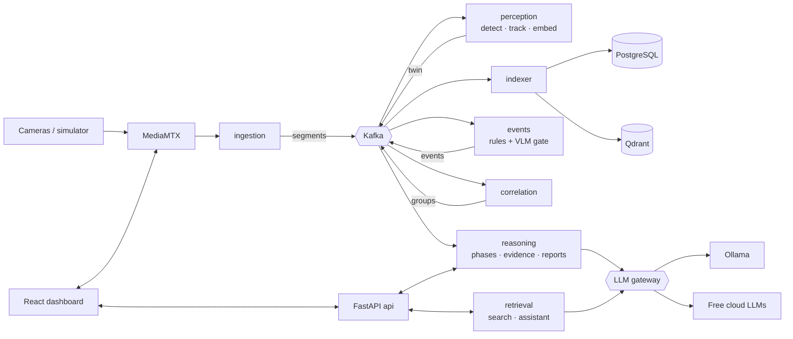

# GenAI-VMS

**A GenAI-powered video management system with multimodal search, event reasoning and automated incident summarization.**

GenAI-VMS turns live multi-camera CCTV into a searchable, explainable record. Every clip becomes a structured digital twin. Events are detected, verified by a vision-language model and linked across cameras. Operators search footage in plain language or with an image. A reasoning pipeline explains incidents phase by phase and writes incident reports, daily security reports and cited answers to questions.

> **Status:** Implementation starting (Phase 1 of 7). Built as the CCVR COE internship project at RV College of Engineering, Bengaluru.

---

## Features

| | |
|---|---|
| **Live monitoring** | 4–6 RTSP cameras, low-latency WebRTC/HLS camera wall, continuous 10 s segment recording |
| **Digital twin** | YOLO11 detection, ByteTrack tracking, colour/motion/zone attributes, SigLIP 2 embeddings for every segment |
| **Event detection** | Intrusion, after-hours access, loitering, crowding, abandoned objects, running, each verified by a VLM before alerting |
| **Multi-camera correlation** | Events linked across overlapping and connected cameras using camera topology and time windows |
| **Reasoning-based search** | Natural-language queries decomposed by an LLM, hybrid vector + metadata retrieval, LLM reranking with reasoning traces, just-in-time VLM refinement, SAM 2.1 object masks |
| **Image search** | Crop a person or object from any frame and find them across cameras |
| **Phase-aware incident reasoning** | Fine-tuned Qwen2.5-VL-3B LoRA adapters segment incidents into phases and describe each phase in each view |
| **Incident reports** | Structured, schema-validated reports with causal chains, contributing factors, recommended actions and evidence citations; PDF export |
| **RAG assistant** | Multi-turn, tool-using assistant that answers questions about the archive with streamed, cited answers |
| **Daily security reports** | Scheduled or on-demand summaries with charts and a fact-checked narrative; PDF export |
| **Investigation timeline** | Multi-camera lanes, correlation links, synchronized playback, saved cases |
| **Local-first GenAI** | Runs on 4 GB-VRAM laptops with Ollama; one config switch moves reasoning to free cloud APIs |

## Architecture



Kafka carries metadata only; video, keyframes, twins and evidence live in S3-compatible object storage. Full design: [`docs/design_architecture.md`](docs/design_architecture.md).

## Tech stack

**Backend:** Python 3.11, FastAPI, Pydantic v2, SQLAlchemy 2, Alembic, aiokafka, uv workspace
**Streaming & media:** Apache Kafka (KRaft), MediaMTX, FFmpeg, PyAV
**Vision:** Ultralytics YOLO11, ByteTrack (supervision), SigLIP 2, SAM 2.1
**GenAI:** Qwen2.5-VL-3B / Qwen2.5-3B via Ollama, QLoRA adapters (Unsloth, PEFT), LiteLLM (Gemini, Groq, OpenRouter free tiers), FastEmbed
**Data:** PostgreSQL 16, Qdrant, Redis, MinIO / S3
**Frontend:** React, Vite, JavaScript, Tailwind CSS, shadcn/ui, TanStack Query, hls.js, Recharts
**Ops:** Docker Compose, Kubernetes (minikube, Strimzi, CloudNativePG), GitHub Actions, GHCR, Prometheus, Grafana

Rationale and alternatives: [`docs/techstack.md`](docs/techstack.md).

## Quick start

### Prerequisites
- Linux or Windows 11 with **WSL2 Ubuntu** (run everything inside WSL2)
- Docker with NVIDIA Container Toolkit; NVIDIA GPU with ≥ 4 GB VRAM
- 16 GB RAM recommended (8 GB → `lite` profile)
- [uv](https://docs.astral.sh/uv/), Node.js 20+, GNU Make

### Run locally with Docker Compose

```bash
git clone <repo-url> genai-vms && cd genai-vms
cp .env.example .env                    # set admin password; cloud API keys are optional
make setup                              # python + node deps, pre-commit hooks

make up PROFILE=infra                   # Kafka, Postgres, Qdrant, Redis, object storage, MediaMTX
make migrate && make topics             # database schema + Kafka topics

make up PROFILE=infra,core,perception   # api, ingestion, indexer, correlation, perception
make sim                                # replay dataset videos as live RTSP cameras

cd frontend && npm run dev              # dashboard on http://localhost:5173
```

Enable GenAI features (events verification, search reasoning, incident reports, assistant):

```bash
ollama pull qwen2.5vl:3b && ollama pull qwen2.5:3b
make up PROFILE=infra,core,perception,genai
# or use free cloud models for reasoning:
VMS_LLM_PROFILE=hybrid make up PROFILE=infra,core,perception,genai
```

| URL | What |
|---|---|
| http://localhost:5173 | Dashboard |
| http://localhost:8000/docs | API (OpenAPI) |
| http://localhost:8080 | Kafka UI |
| http://localhost:6333/dashboard | Qdrant |
| http://localhost:3000 | Grafana (`obs` profile) |

### Run on Kubernetes (minikube)

```bash
make k8s-up          # minikube start (GPU if available), operators, infra, apps, ingress
make k8s-status
make k8s-down
```

If GPU passthrough into minikube isn't available on your machine, GPU services run on the host and are exposed into the cluster; see `deploy/k8s/README.md`.

### Two-laptop demo

With 4 GB GPUs, perception and GenAI run best on separate machines: laptop A runs the pipeline and perception, laptop B runs Ollama and the reasoning services. Set `VMS_GENAI_HOST` on laptop A and `VMS_INFRA_HOST` on laptop B. Details in `docs/design_architecture.md §11.3`.

## Repository layout

```text
libs/        shared contracts, Kafka/S3/LLM clients, database models
services/    ingestion · perception · indexer · events · correlation · retrieval · reasoning · api
frontend/    React dashboard
ml/          annotation, datasets, fine-tuning notebooks, evaluation harnesses
config/      model registry, rules, correlation and VQA configuration
deploy/      Docker Compose profiles and Kubernetes manifests
tools/       camera simulator, seed data
docs/        product, requirements, design and team documents
```

## Documentation

| Document | Contents |
|---|---|
| [`docs/context.md`](docs/context.md) | Background, research foundation, decision log, constraints, glossary |
| [`docs/PRD.md`](docs/PRD.md) | Personas, journeys, features, success metrics, release plan |
| [`docs/SRS.md`](docs/SRS.md) | Functional and non-functional requirements, evaluation requirements |
| [`docs/design_architecture.md`](docs/design_architecture.md) | Services, Kafka contracts, schemas, pipelines, deployment, ADRs |
| [`docs/techstack.md`](docs/techstack.md) | Technology choices with rationale |
| [`docs/style_guide.md`](docs/style_guide.md) | Code, Git, API conventions and UI design system |
| [`docs/backlog.md`](docs/backlog.md) | Epics, stories, points, acceptance criteria |
| [`docs/team/DIVYANSH.md`](docs/team/DIVYANSH.md), [`docs/team/JATIN.md`](docs/team/JATIN.md) | Per-builder workload |
| [`CLAUDE.md`](CLAUDE.md) | Instructions for Claude Code agents |

## Research foundation

| Pillar | Paper | What this project takes from it |
|---|---|---|
| Summarization | De Silva et al., *Large Language Models for Video Surveillance Applications*, IEEE TENCON 2024 | Video-to-text summaries as a searchable archive |
| Event reasoning | Zhen et al., *MP-PVIR: Multi-View Phase-Aware Pedestrian-Vehicle Incident Reasoning*, 2025 | Phase segmentation → phase-specific multi-view captioning/VQA → structured LLM incident reports |
| Search | Shen et al., *Reasoning Text-to-Video Retrieval via Digital Twin Video Representations*, 2025 | Digital twins, LLM query decomposition, coarse-to-fine reasoning retrieval, just-in-time refinement, object grounding |

The system adapts these ideas from short benchmark clips to continuous, multi-camera, live surveillance on consumer hardware.

## Evaluation

Retrieval accuracy (Recall@K, mAP, temporal IoU with ablations), phase reasoning (mIoU, captioning metrics, VQA accuracy), response quality (faithfulness, citation precision, report rubric), latency (ingest-to-index, event-to-alert, search, report generation) and usability (SUS, task time). Harnesses live in `ml/evaluation/`; results are published per phase.

## Roadmap

| Phase | Milestone |
|---|---|
| 1 | Live multi-camera ingestion, login, camera wall |
| 2 | Perception, digital twin, playback with overlays |
| 3 | Verified events, multi-camera correlation, alerts |
| 4 | Text and image search with reasoning and grounding |
| 5 | Fine-tuned phase-aware reasoning |
| 6 | Incident reports, assistant, daily reports, investigation timeline |
| 7 | Kubernetes, cloud deployment, full evaluation |

## Team

| | Role |
|---|---|
| **Divyansh Pankaj Mishra** | Ingestion, perception, events, LLM gateway, text search, reasoning & synthesis, assistant, Kubernetes infra, observability |
| **Jatin Bansal** | API & auth, dashboard, indexing & playback, correlation, alerts, image search & grounding, evidence & reports, CI/CD, cloud deployment, evaluation |
| **Kuldeep Nagar** | Documentation, testing, evaluation |
| **Pankaj Raikar** | Documentation, testing, evaluation |

**Guide:** Prof. Chandrani Chakravorty, Department of MCA, RV College of Engineering

## Licence notes

Licence for this repository: to be decided by the team. Third-party components keep their own licences. In particular, **Ultralytics YOLO is AGPL-3.0**, and the datasets used (MEVA, WILDTRACK, UCF-Crime, ShanghaiTech Campus) are for research use under their respective terms. Model weights follow their providers' licences.
