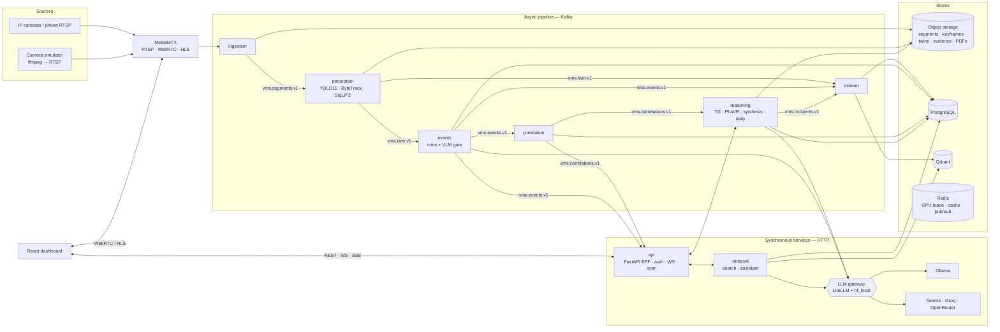
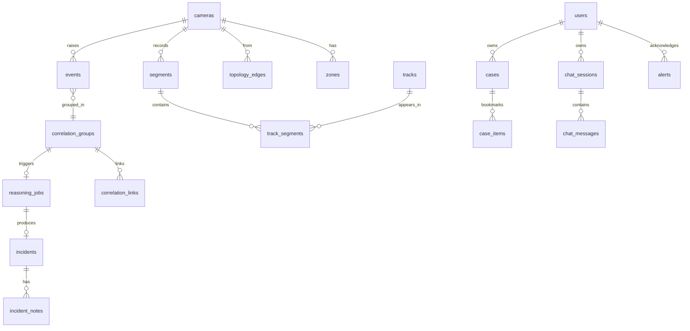
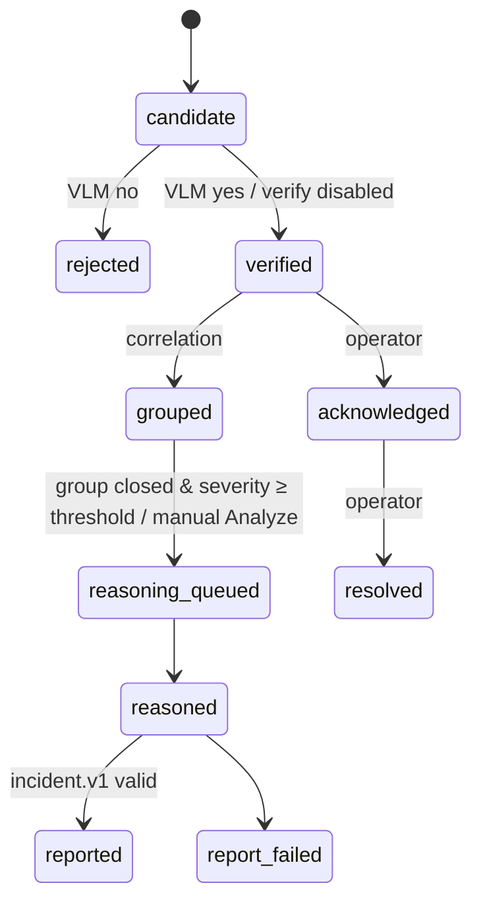
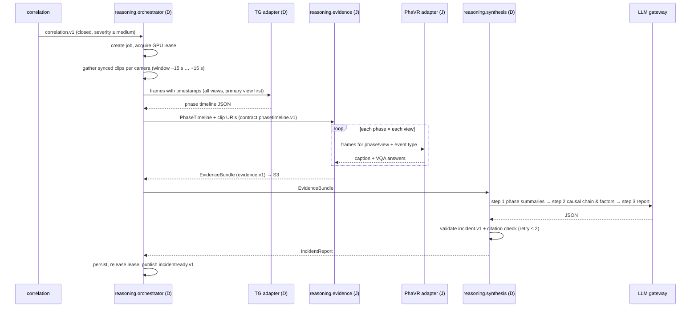
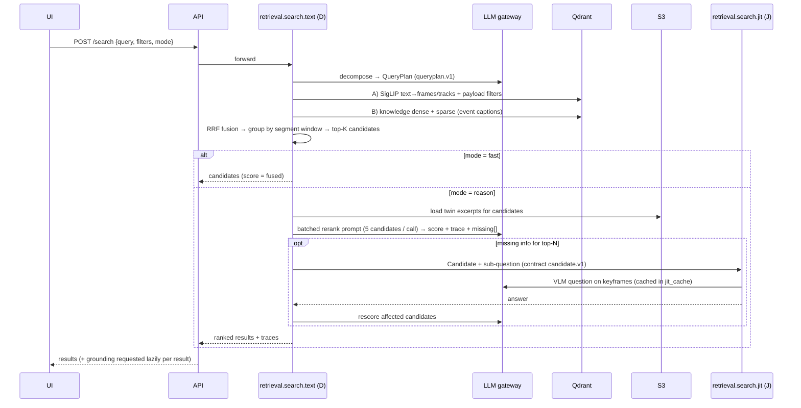

# Design & Architecture

| | |
|---|---|
| **Version** | 0.1 (kickoff) — 17 Sep 2026 |
| **Owners** | Divyansh (Track D), Jatin (Track J) — each section lists its owner |
| **Related** | `SRS.md` (requirements), `techstack.md` (versions), `backlog.md` (stories) |

> VRAM figures and latencies in this document are **planning estimates**. Replace them with measured values from stories P2-D6 (perception benchmark) and P3-D3 (gateway/VLM benchmark).

---

## 1. Design principles

1. **One representation, three pillars.** The per-segment digital twin feeds search, event reasoning and summarization. No pillar re-processes raw video unless it needs pixels (VLM, masks).
2. **Cheap filter → expensive reasoning** at every layer: motion/rules before VLM, embeddings before LLM rerank, correlation-group close before phase reasoning.
3. **Metadata on Kafka, pixels in object storage.** Messages carry URIs.
4. **Local-first, cloud-switchable.** Every GenAI call goes through one gateway selected by task name and profile.
5. **Contract-first parallelism.** Divyansh and Jatin build against frozen Pydantic contracts and shared fixtures, never against each other's unfinished code.
6. **Evidence or it didn't happen.** Every generated sentence that makes a claim cites evidence ids.
7. **Degrade, don't die.** Recording and playback never depend on GPU or LLM availability.

## 2. Architecture overview



### 2.1 Planes
| Plane | Components | Nature |
|---|---|---|
| **Media plane** | MediaMTX, ingestion, object storage | Continuous, never blocked by AI |
| **Perception plane** | perception, indexer | Near-real-time, GPU node A |
| **Event plane** | events, correlation, api alerts | Near-real-time, small GPU use (VLM gate) |
| **GenAI plane** | reasoning, retrieval, LLM gateway, Ollama | On demand / queued, GPU node B |
| **Experience plane** | api, frontend | Synchronous |

## 3. Repository structure & ownership

```text
genai-vms/
├── README.md
├── CLAUDE.md
├── pyproject.toml                # uv workspace root
├── Makefile                      # dev entrypoints (make up, make test, …)
├── config/
│   ├── models.yaml               # model registry per LLM profile            (D)
│   ├── rules.yaml                # default event rule thresholds             (D)
│   └── correlation.yaml          # compatibility matrix, grace windows       (J)
├── libs/
│   ├── vms_common/               # shared runtime library
│   │   ├── contracts/            # Pydantic message & document schemas       (D + J co-owned)
│   │   ├── fixtures/             # sample messages/documents for tests       (D + J co-owned)
│   │   ├── kafka/                # producer/consumer wrappers, DLQ           (D)
│   │   ├── storage/              # S3 client, presign, URI helpers           (D)
│   │   ├── llm/                  # LLM gateway, registry, GPU lease          (D)
│   │   ├── config.py, logging.py, metrics.py                                 (D)
│   └── vms_db/                   # SQLAlchemy models, session, Alembic       (J base; table owners per §6.1)
├── services/
│   ├── ingestion/                # RTSP → segments → S3 → Kafka              (D)
│   ├── perception/               # detect, track, attributes, twin, embed    (D)
│   │   └── grounding/            # SAM 2.1-tiny mask endpoint                (J)
│   ├── indexer/                  # twin/events/incidents → PG + Qdrant       (J)
│   ├── events/                   # rule engine + VLM gate                    (D)
│   ├── correlation/              # time-aligned multi-camera linking         (J)
│   ├── retrieval/
│   │   ├── search/text/          # plan, coarse, rerank                      (D)
│   │   ├── search/image/         # image query                               (J)
│   │   ├── search/jit/           # just-in-time refinement                   (J)
│   │   └── assistant/            # RAG agent, memory, SSE                    (D)
│   ├── reasoning/
│   │   ├── orchestrator/         # job queue, phase segmentation, serving    (D)
│   │   ├── evidence/             # per-phase per-view captions + VQA         (J)
│   │   ├── synthesis/            # incident report synthesis                 (D)
│   │   └── reports/              # daily security reports + PDFs             (J)
│   └── api/                      # auth, CRUD, alerts, WS, BFF proxy         (J)
├── frontend/                     # React + Vite + JS + Tailwind + shadcn/ui
│   └── src/features/
│       ├── auth, live, playback, settings, alerts, events, investigation,
│       │   incidents, reports, search-image                                  (J)
│       └── search, assistant                                                 (D)
├── ml/
│   ├── annotation/               # Label Studio configs + guidelines   (phase: D, caption/VQA: J)
│   ├── datasets/                 # download scripts, manifests, builders     (D / J per task)
│   ├── training/                 # Kaggle/Colab notebooks (tg: D, phavr: J)
│   └── evaluation/               # retrieval (J), reasoning (D/J), response quality (J), latency (D)
├── tools/
│   ├── camera_sim/               # dataset → RTSP replay                     (D)
│   └── seed/                     # demo data seeding                         (J)
├── deploy/
│   ├── compose/                  # docker-compose.yml + profiles             (infra: D, apps: J)
│   └── k8s/                      # kustomize base + overlays                 (infra: D, apps: J)
└── docs/
```

`CODEOWNERS` encodes the owner column. Owners write; the other builder reviews every PR (knowledge sharing + contract policing).

## 4. Services

| Service | Responsibility | Consumes | Produces | GPU | Port | Owner |
|---|---|---|---|---|---|---|
| **ingestion** | One worker per camera: RTSP pull (PyAV), segmenter (ffmpeg, `-c copy`), 1 fps keyframes, reconnect/backoff, status heartbeat | camera config (API internal / YAML fallback) | S3 segments + keyframes, `vms.segments.v1`, Redis `camera:status` | No | — | D |
| **perception** | Decode + sample, batched YOLO11 detection across cameras, per-camera ByteTrack with persistent state, attributes, zone membership, SigLIP2 embeddings, twin JSON; hosts `grounding` endpoint | `vms.segments.v1` | S3 twin + `.npz` embeddings, `vms.twin.v1` | Node A | 8030 (internal) | D (grounding: J) |
| **indexer** | Idempotent writes of segments, tracks, event captions, incident sections into PG + Qdrant | `vms.twin.v1`, `vms.events.v1`, `vms.incidents.v1` | PG rows, Qdrant points | No | — | J |
| **events** | Sliding per-camera state over twins; rules; candidate → VLM verification; persistence | `vms.twin.v1` | `vms.events.v1`, PG `events.*` | Node B (lease) | — | D |
| **correlation** | Topology-aware time-aligned linking; group open/close | `vms.events.v1` | `vms.correlations.v1`, PG groups/links | No | — | J |
| **reasoning** | Queue reasoning jobs; TG phase segmentation; PhaVR evidence; incident synthesis; daily reports (scheduler + on demand); PDFs | `vms.correlations.v1`, HTTP | `vms.incidents.v1`, S3 evidence/PDF, PG | Node B (lease) | 8020 | D + J (modules) |
| **retrieval** | Text search pipeline, image search, JIT refinement, RAG assistant | HTTP | JSON / SSE | CPU (SigLIP text+vision, bge); GPU via gateway | 8010 | D + J (modules) |
| **api** | Auth/RBAC, CRUD, recordings playlists, alerts (Kafka → WS), notifier plugins, BFF proxy to retrieval/reasoning, audit | `vms.events.v1`, `vms.correlations.v1`, `vms.incidents.v1` | REST, WS, SSE passthrough | No | 8000 | J |
| **frontend** | Dashboard SPA | api | — | No | 5173 | J (search, assistant: D) |
| **MediaMTX** | RTSP ingest/re-stream, WebRTC + HLS to browser | cameras/simulator | streams | No | 8554/8889/8888 | D |

## 5. Kafka topics & message contracts (owner: D + J)

### 5.1 Conventions
- Naming `vms.<domain>.v<major>`. Breaking change → new topic version; producers dual-publish during migration.
- JSON (UTF-8), validated by Pydantic v2 models in `libs/vms_common/contracts`. Every message has `schema_version`, `message_id` (UUIDv7), `produced_at`.
- Keys: `camera_id` for camera-scoped topics (preserves per-camera order), `site_id` for correlations.
- Delivery: at-least-once. Consumers commit offsets **after** idempotent write. 3 failures → `vms.dlq.v1` with headers `x-origin-topic`, `x-error`, `x-attempts`.
- Kafka in KRaft mode, single broker for dev/demo (`replication.factor=1`).

### 5.2 Topics
| Topic | Key | Partitions | Retention | Producer | Consumers |
|---|---|---|---|---|---|
| `vms.segments.v1` | camera_id | 6 | 24 h | ingestion | perception |
| `vms.twin.v1` | camera_id | 6 | 72 h | perception | indexer, events |
| `vms.events.v1` | camera_id | 6 | 7 d | events | correlation, indexer, api |
| `vms.correlations.v1` | site_id | 3 | 7 d | correlation | reasoning, api |
| `vms.incidents.v1` | site_id | 3 | 7 d | reasoning | indexer, api |
| `vms.dlq.v1` | original key | 1 | 14 d | all | ops (kafka-ui) |

### 5.3 Message schemas (abridged)

**`segment.v1`** — ingestion → perception
```json
{
  "schema_version": "segment.v1",
  "message_id": "0192f3c4-…",
  "produced_at": "2026-10-05T10:15:10.412Z",
  "site_id": "rvce-campus",
  "camera_id": "cam03",
  "segment_id": "cam03_20261005T101500Z_000123",
  "start_ts": "2026-10-05T10:15:00.000Z",
  "end_ts": "2026-10-05T10:15:10.000Z",
  "uri": "s3://vms-segments/cam03/2026/10/05/10/cam03_20261005T101500Z_000123.ts",
  "keyframes_prefix": "s3://vms-keyframes/cam03/2026/10/05/10/000123/",
  "fps": 25.0, "width": 1920, "height": 1080, "codec": "h264",
  "gap_before": false
}
```

**`twinready.v1`** — perception → indexer, events
```json
{
  "schema_version": "twinready.v1",
  "message_id": "…", "produced_at": "…",
  "site_id": "rvce-campus", "camera_id": "cam03",
  "segment_id": "cam03_20261005T101500Z_000123",
  "start_ts": "…", "end_ts": "…",
  "twin_uri": "s3://vms-twins/cam03/2026/10/05/10/000123.json",
  "embeddings_uri": "s3://vms-twins/cam03/2026/10/05/10/000123.npz",
  "sample_fps": 2.0,
  "counts": {"person": 4, "backpack": 1},
  "track_ids": ["cam03-t412", "cam03-t415"],
  "perception_version": "yolo11s-bytetrack-siglip2b@0.3.0"
}
```

**`event.v1`** — events → correlation, indexer, api
```json
{
  "schema_version": "event.v1",
  "message_id": "…", "produced_at": "…",
  "event_id": "0192f3d1-…",
  "site_id": "rvce-campus", "camera_id": "cam02",
  "event_type": "intrusion",
  "severity": "high",
  "start_ts": "…", "end_ts": "…",
  "rule_id": "intrusion.after_hours", "rule_score": 0.91,
  "zone_id": "0192…", "track_ids": ["cam02-t88"],
  "segment_ids": ["cam02_…_000120", "cam02_…_000121"],
  "keyframe_uris": ["s3://vms-keyframes/…/000120/0004.jpg"],
  "verification": {
    "status": "verified",
    "confidence": 0.84,
    "caption": "A person in a dark jacket climbs over the gate into the fenced area.",
    "model": "ollama/qwen2.5vl:3b",
    "latency_ms": 5210
  }
}
```

**`correlation.v1`** — correlation → reasoning, api
```json
{
  "schema_version": "correlation.v1",
  "message_id": "…", "produced_at": "…",
  "group_id": "0192f3e0-…", "site_id": "rvce-campus",
  "status": "closed",
  "event_ids": ["…cam02…", "…cam04…"],
  "camera_ids": ["cam02", "cam04"],
  "start_ts": "…", "end_ts": "…",
  "max_severity": "high",
  "links": [
    {"from_event": "…", "to_event": "…", "edge_type": "transit", "delta_s": 38.2, "score": 0.88}
  ]
}
```

**`incidentready.v1`** — reasoning → indexer, api
```json
{
  "schema_version": "incidentready.v1",
  "message_id": "…", "produced_at": "…",
  "incident_id": "…", "group_id": "…", "site_id": "rvce-campus",
  "status": "generated",
  "severity": "high",
  "report_uri": "s3://vms-evidence/incidents/…/report.json",
  "title": "After-hours intrusion via north gate"
}
```

## 6. Data stores

### 6.1 PostgreSQL (single database `vms`, schema per domain, one Alembic history in `libs/vms_db`)

| Schema.table | Purpose | Owner |
|---|---|---|
| `core.users`, `core.refresh_tokens` | Accounts, roles | J |
| `core.cameras`, `core.zones`, `core.topology_edges` | Configuration | J |
| `core.alerts`, `core.audit_log` | Alert lifecycle, audit | J |
| `core.cases`, `core.case_items` | Investigation cases | J |
| `media.segments`, `media.gaps` | Segment index | J |
| `vision.tracks`, `vision.track_segments`, `vision.minute_counts` | Track summaries, density | J |
| `events.candidates`, `events.events` | Rule hits, verified events | D |
| `events.correlation_groups`, `events.correlation_links` | Correlation | J |
| `reasoning.jobs`, `reasoning.incidents`, `reasoning.incident_notes` | Reasoning queue, reports | D |
| `reasoning.daily_reports` | Daily reports | J |
| `retrieval.search_logs`, `retrieval.jit_cache` | Evaluation logs, JIT answers | J |
| `retrieval.chat_sessions`, `retrieval.chat_messages` | Assistant memory | D |



Key columns (selected):
- `core.cameras(id uuid pk, code text unique, name, rtsp_url, site_id, location_label, lat, lon, enabled bool, created_at)`
- `core.zones(id, camera_id fk, name, zone_type enum(generic,restricted,entrance,exit), polygon jsonb /* normalized [[x,y],…] */, schedule jsonb null)`
- `core.topology_edges(id, from_camera_id, to_camera_id, edge_type enum(overlap,transit), min_s, max_s, tolerance_s, bidirectional bool)`
- `media.segments(segment_id text pk, camera_id, start_ts timestamptz, end_ts, uri, twin_uri, indexed_at)` — index `(camera_id, start_ts)`
- `events.events(id, camera_id, event_type, severity, start_ts, end_ts, rule_id, rule_score, zone_id, track_ids text[], verification jsonb, group_id null, status enum(open,acknowledged,resolved))`
- `reasoning.incidents(id, group_id, status enum(generating,generated,failed,reviewed,closed), severity, title, report jsonb, report_uri, pdf_uri, provenance jsonb, created_at)`

### 6.2 Qdrant collections (owner: J; query side: D)

| Collection | Vectors | Payload (indexed fields **bold**) | Written from |
|---|---|---|---|
| `frames` | `siglip`: 768-d, cosine | **camera_id**, **site_id**, **ts** (epoch ms), segment_id, keyframe_uri, **categories**[], person_count | twin embeddings |
| `tracks` | `siglip`: 768-d, cosine | track_id, **camera_id**, **category**, **colors**[], **first_ts**, last_ts, **zones**[], crop_uri, segment_ids[] | twin best crops |
| `knowledge` | `dense`: 384-d (bge-small-en-v1.5), `sparse`: BM25 | **doc_type** (event_caption, incident_section, daily_report), ref_id, **camera_ids**[], **ts_start**, ts_end, **severity**, text | events, incidents, daily reports |

### 6.3 Object storage layout (S3-compatible)

| Bucket | Content | Lifecycle |
|---|---|---|
| `vms-segments` | `{camera}/{yyyy}/{mm}/{dd}/{hh}/{segment_id}.ts` | 7 d |
| `vms-keyframes` | `{camera}/…/{seq}/{nnnn}.jpg` | 30 d |
| `vms-twins` | twin JSON + `.npz` embeddings | 30 d |
| `vms-crops` | best track crops | 30 d |
| `vms-masks` | RLE masks from grounding | 30 d |
| `vms-evidence` | evidence bundles, incident report JSON, sampled phase frames | none |
| `vms-reports` | incident + daily PDFs | none |
| `vms-models` | LoRA adapters `tg/vN`, `phavr/vN` | none |

Browsers only get presigned GET URLs (≤ 15 min).

## 7. Perception, digital twin, events & correlation

### 7.1 Perception flow (owner: D)
1. Consume `segment.v1`; download or stream the segment.
2. Decode with PyAV, sample at `sample_fps` (default 2; **adaptive**: drop to 1 when consumer lag > 60 s).
3. Batch frames across cameras (batch ≤ 8) → YOLO11 FP16.
4. Per-camera ByteTrack (`supervision`) with tracker state kept in memory keyed by `camera_id` and checkpointed to Redis every segment (survives restarts).
5. Attributes: HSV k-means dominant colour on upper/lower halves of person crops; colour for vehicles/bags; speed and direction from track centroid displacement (normalized units/s); zone membership by point-in-polygon on bbox bottom-centre.
6. Embeddings: SigLIP2 on keyframes every 2 s and on one best crop per track per segment (largest area × confidence).
7. Write twin JSON + `.npz`; publish `twinready.v1`.

### 7.2 Digital twin schema `twin.v1`
```json
{
  "schema_version": "twin.v1",
  "segment_id": "cam03_20261005T101500Z_000123",
  "camera_id": "cam03", "site_id": "rvce-campus",
  "start_ts": "…", "end_ts": "…",
  "sample_fps": 2.0, "frame_size": {"w": 1920, "h": 1080},
  "frames": [
    {
      "ts": "2026-10-05T10:15:00.500Z", "idx": 1,
      "keyframe_uri": "s3://vms-keyframes/…/0001.jpg",
      "objects": [
        {
          "track_id": "cam03-t412", "category": "person", "conf": 0.91,
          "bbox": [0.412, 0.310, 0.468, 0.702],
          "attributes": {"upper_color": "red", "lower_color": "black"},
          "motion": {"speed": 0.08, "direction_deg": 265},
          "zones": ["entrance"]
        }
      ]
    }
  ],
  "tracks": [
    {
      "track_id": "cam03-t412", "category": "person",
      "first_ts": "…", "last_ts": "…", "dwell_s": 9.5,
      "zones_visited": ["entrance"],
      "attributes_summary": {"upper_color": "red", "lower_color": "black"},
      "best_crop_uri": "s3://vms-crops/…/cam03-t412.jpg",
      "embedding_index": 7
    }
  ],
  "scene": {"person_count_max": 4, "vehicle_count_max": 1}
}
```
Bboxes are normalized `[x1, y1, x2, y2]`. Masks are **not** in the twin; they are produced on demand (§10.2).

### 7.3 Event rules (owner: D) — defaults in `config/rules.yaml`
| Rule id | Logic over sliding twin state | Default params | Severity |
|---|---|---|---|
| `intrusion.restricted` | person/vehicle bottom-centre inside `restricted` zone | min_frames 2 | high |
| `intrusion.after_hours` | any person in zone outside its schedule | schedule per zone | high |
| `loitering` | same track in zone with dwell > T | T = 60 s | medium |
| `crowding` | persons in zone > N for > T | N = 8, T = 20 s | medium |
| `abandoned_object` | bag/suitcase static (Δcentroid < ε) > T and no person within radius r for > T2 | T = 30 s, r = 0.08, T2 = 20 s | high |
| `running` | person speed > S for ≥ k samples | S = 0.35 /s, k = 3 | low |

Candidates are debounced per `(camera, rule, track)`; an open candidate extends while the condition holds.

### 7.4 VLM verification gate (owner: D)
- Input: up to 4 keyframes spanning the candidate window, bbox of involved tracks drawn as coloured boxes, rule description.
- Prompt returns JSON `{"verdict": "yes|no|unsure", "confidence": 0–1, "caption": "…"}` validated by Pydantic; invalid → 1 retry → `unsure`.
- `yes` & confidence ≥ 0.6 → verified; `no` → rejected (stored); `unsure` → verified with `confidence` flag for low-severity rules, rejected for others (configurable).
- Rules may set `verify: false`.

### 7.5 Multi-camera correlation (owner: J)

Topology edge semantics:
- **overlap(A,B, tolerance τ):** cameras see the same area. Events link if their windows intersect after expanding each by τ.
- **transit(A→B, min, max):** B reachable from A. Events link if `start(eB) − end(eA) ∈ [min, max]` (both directions when `bidirectional`).

```text
on verified event e (camera c, window [s, t], type k):
    candidates = open events e' in open groups on cameras c' with edge(c, c')
    for e' in candidates:
        if not compatible(k, type(e')): continue          # config/correlation.yaml
        fit = temporal_fit(edge, e, e')                   # 1.0 at centre of window → 0 at bounds
        score = 0.7*fit + 0.3*compat_weight(k, type(e'))
        if score ≥ 0.5: link(e, e', score)
    groups = union_find(links)                            # e joins/merges groups
    group.max_severity = max(...)
close group when now − last_event_end > max_transit(group cameras) + grace (default 30 s)
publish correlation.v1 on open→update (throttled 5 s) and on close
```
Events with no links become single-event groups (still closed and published, so reasoning can run on them if severe enough). Appearance similarity is **future work** (ADR-008).

### 7.6 Event lifecycle


## 8. Event reasoning & incident synthesis

### 8.1 Pipeline


### 8.2 General-surveillance phase taxonomy (adapted from MP-PVIR)
MP-PVIR's pedestrian phases (pre-recognition → recognition → judgment → action → avoidance) describe one actor's cognition in a traffic conflict. Surveillance incidents need phases observable from the scene. **Needs guide approval.**

| Phase | Definition (what annotators mark) | Intrusion example | Theft example | Abandoned object example |
|---|---|---|---|---|
| `baseline` | Normal scene before any relevant deviation | Empty gate area | Shoppers browsing | Person walking with bag |
| `precursor` | First observable signals tied to the later incident (approach, watching, lingering) | Person paces along fence | Person watches counter, looks around | Person stops, looks around |
| `escalation` | Decision point / build-up; incident becomes likely | Person grips gate, checks for guards | Hand moves toward item | Bag placed on floor |
| `action` | The core incident act | Climbs over, enters restricted area | Takes and conceals item | Person walks away without bag |
| `aftermath` | Consequences and responses | Moves out of view to cam04 | Leaves store; staff reacts | Bag unattended; others react |

Phases are contiguous and ordered; any may be empty. Primary view = camera with highest-severity event.

### 8.3 Adapters & training (TG: D, PhaVR: J)
| | TG adapter (temporal phase grounding) | PhaVR adapter (phase captioning + VQA) |
|---|---|---|
| Base | `Qwen/Qwen2.5-VL-3B-Instruct` (same base for both) | same |
| Method | QLoRA (4-bit NF4), r = 16, α = 32, dropout 0.05, LR 2e-4 cosine, 2–3 epochs | same hyperparameters, separate adapter |
| Input | ≤ 16 frames sampled uniformly, each labelled `Frame i @ t s`, max 360p per frame, event type, camera count | ≤ 8 frames of one phase in one view + phase name + event type + question |
| Output | `{"phases":[{"phase":"precursor","start_s":3.5,"end_s":9.0}, …]}` | caption text; VQA short answers |
| Data | Phase-annotated clips (UCF-Crime subset + MEVA multi-view subset), split **by source video** 70/15/15 | Phase captions + VQA per view (pseudo-labelled by the largest open VLM we can run on Kaggle, then human-verified) |
| Compute | Kaggle / Colab free T4 (16 GB) with Unsloth | same |
| Metrics | mIoU across phases; boundary error (s) | BLEU-4, METEOR, ROUGE-L, CIDEr; VQA accuracy |
| Baselines | zero-shot base 3B; zero-shot cloud VLM | same |

**Serving:** `hf_local` provider loads the 4-bit base once and hot-swaps LoRA adapters with PEFT (`set_adapter("tg")` / `set_adapter("phavr")`), so both tasks cost one base model's VRAM.

**VQA question bank** (per event type, `config/vqa_bank.yaml`, owner J), e.g. intrusion: *Is anyone crossing a barrier? Is the person carrying anything? Is any staff/guard visible? Which direction does the person move? Is the area lit?*

### 8.4 Evidence bundle `evidence.v1` (owner: J, consumed by D)
```json
{
  "schema_version": "evidence.v1",
  "group_id": "…", "event_type": "intrusion", "severity": "high",
  "cameras": ["cam02", "cam04"], "primary_camera": "cam02",
  "window": {"start": "…", "end": "…"},
  "phase_timeline": [
    {"phase": "precursor", "start": "…", "end": "…", "source": "tg-adapter@v1"}
  ],
  "phases": [
    {
      "phase": "precursor",
      "views": [
        {
          "camera_id": "cam02",
          "caption": {"id": "ev-cap-01", "text": "A person in a dark jacket walks along the fence twice."},
          "vqa": [{"id": "ev-qa-03", "q": "Is anyone crossing a barrier?", "a": "No"}],
          "frames": [{"id": "ev-fr-11", "uri": "s3://vms-evidence/…/f11.jpg", "ts": "…"}]
        }
      ]
    }
  ],
  "events": [{"id": "…", "camera_id": "cam02", "caption": "…"}],
  "provenance": {"tg": "hf_local/qwen2.5-vl-3b+tg@v1", "phavr": "hf_local/qwen2.5-vl-3b+phavr@v1", "fallback_used": false}
}
```

### 8.5 Incident report `incident.v1` (owner: D, consumed by J)
Adapted from MP-PVIR's report schema.
```json
{
  "schema_version": "incident.v1",
  "incident_id": "…", "group_id": "…",
  "title": "After-hours intrusion via north gate",
  "event_type": "intrusion", "severity": "high",
  "window": {"start": "…", "end": "…"}, "cameras": ["cam02", "cam04"],
  "scene_understanding": {
    "location": "North gate and service lane",
    "conditions": "Night, artificial lighting, no guards visible",
    "actors": [{"ref": "cam02-t88", "description": "Adult in dark jacket, carrying backpack", "evidence": ["ev-cap-01"]}]
  },
  "phase_analysis": [
    {"phase": "precursor", "summary": "…", "evidence": ["ev-cap-01", "ev-fr-11"]}
  ],
  "causal_chain": [
    {"step": 1, "description": "Fence left unmonitored after 22:00 allowed repeated approach", "evidence": ["ev-qa-03"]}
  ],
  "contributing_factors": {
    "primary": [{"text": "…", "evidence": ["…"]}],
    "environmental": [{"text": "…", "evidence": ["…"]}],
    "security_gaps": [{"text": "…", "evidence": ["…"]}]
  },
  "recommended_actions": [
    {"action": "Add after-hours patrol to north gate", "priority": "high", "owner_role": "supervisor"}
  ],
  "confidence": 0.74,
  "limitations": ["cam04 view partially occluded during aftermath"],
  "evidence_index": ["ev-cap-01", "ev-qa-03", "ev-fr-11"],
  "provenance": {"synthesis_model": "gemini/gemini-2.5-flash", "prompt_version": "synth-1.0", "profile": "hybrid"}
}
```
**Validation:** Pydantic model → every `evidence` id must exist in the bundle → retry with the error message (≤ 2) → else `status=failed` with raw output stored.

## 9. API surface (`services/api`, owner J unless noted)

Base path `/api/v1`. JSON errors use the envelope in `style_guide.md §A.5`.

| Area | Endpoints | Roles |
|---|---|---|
| Auth | `POST /auth/login`, `POST /auth/refresh`, `POST /auth/logout`, `GET /auth/me` | all |
| Users | `GET/POST /users`, `PATCH/DELETE /users/{id}` | admin |
| Cameras | `GET/POST /cameras`, `GET/PATCH/DELETE /cameras/{id}`, `GET /cameras/{id}/snapshot`, `GET /cameras/status` | read: all; write: admin |
| Zones | `GET/POST /cameras/{id}/zones`, `PATCH/DELETE /zones/{id}` | read: all; write: admin |
| Topology | `GET/POST /topology/edges`, `PATCH/DELETE /topology/edges/{id}` | read: all; write: admin |
| Recordings | `GET /recordings/{camera_id}/segments?start&end`, `GET /recordings/{camera_id}/playlist.m3u8?start&end`, `GET /recordings/{camera_id}/density?start&end&bucket=60`, `GET /twin/{camera_id}/frames?start&end` | all |
| Events | `GET /events?camera&type&severity&status&start&end`, `GET /events/{id}`, `POST /events/{id}/analyze` | all; analyze: operator+ |
| Alerts | `GET /alerts`, `POST /alerts/{id}/ack`, `POST /alerts/{id}/resolve`, `WS /ws?token=` | operator+ |
| Correlations | `GET /correlations?start&end`, `GET /correlations/{id}` | all |
| Search (proxy → retrieval) | `POST /search` (text), `POST /search/image` (multipart or `{frame_uri, bbox}`), `POST /search/grounding` | all |
| Reasoning (proxy → reasoning) | `GET /reasoning/jobs`, `GET /reasoning/jobs/{id}` | all |
| Incidents | `GET /incidents`, `GET /incidents/{id}`, `PATCH /incidents/{id}` (status/notes), `GET /incidents/{id}/pdf`, `GET /incidents/{id}/similar` | all; patch: operator+ |
| Assistant (proxy, **D**) | `GET/POST /assistant/sessions`, `GET /assistant/sessions/{id}`, `POST /assistant/sessions/{id}/messages` → SSE | all |
| Reports | `GET /reports/daily`, `POST /reports/daily` (on demand), `GET /reports/daily/{id}`, `GET /reports/daily/{id}/pdf` | read: all; generate: operator+ |
| Cases | `GET/POST /cases`, `GET/PATCH/DELETE /cases/{id}`, `POST /cases/{id}/items` | operator+ |
| Internal (service token) | `GET /internal/v1/cameras`, `GET /internal/v1/zones`, `GET /internal/v1/topology` | services |
| Ops | `GET /health`, `GET /ready`, `GET /metrics` | public/internal |

**WebSocket message types:** `alert.created`, `alert.updated`, `camera.status`, `job.progress`, `incident.ready`.

**Playback strategy:** `playlist.m3u8` is generated on the fly as an HLS VOD playlist listing presigned URLs of the `.ts` segments covering `[start, end]` (with `#EXT-X-PROGRAM-DATE-TIME` so the UI can map player time → wall clock). No transcoding.

## 10. Search, assistant & daily reports

### 10.1 Text search pipeline (owner D; JIT J)


**`queryplan.v1`**
```json
{
  "schema_version": "queryplan.v1",
  "original": "someone left a bag near the entrance and walked away this morning",
  "entities": [{"id": "p1", "category": "person"}, {"id": "b1", "category": "bag", "attributes": {}}],
  "relations": [{"subject": "p1", "predicate": "leaves", "object": "b1"}],
  "actions": ["abandon object"],
  "spatial": {"zones": ["entrance"], "cameras": []},
  "temporal": {"start": "2026-10-05T00:30:00Z", "end": "2026-10-05T06:30:00Z"},
  "visual_queries": ["a bag on the floor near a doorway", "a person walking away from a bag"],
  "text_queries": ["abandoned bag near entrance"],
  "sub_questions": ["Is the bag left without its owner?", "Is it near the entrance?"],
  "event_types_hint": ["abandoned_object"]
}
```
Relative times ("this morning") are resolved by the LLM using the provided current time and site timezone, then clamped by validation.

**`candidate.v1`** (D → J): `{candidate_id, camera_id, segment_ids, window, keyframe_uris, twin_excerpt, fused_score, matched_track_ids, missing: [sub_question]}`

### 10.2 Image search & grounding (owner J)
- **Image query:** upload or `{frame_uri, bbox}` → crop → SigLIP2 vision (CPU in retrieval) → `tracks` collection with optional filters → group by track → results sorted by score then time.
- **Grounding:** `POST perception:8030/internal/grounding {keyframe_uri, bbox}` → SAM 2.1-tiny box prompt → RLE mask cached in `vms-masks` → UI draws the mask. Lazy: only when a result card becomes visible.

### 10.3 RAG assistant (owner D)
- **Agent loop:** gateway `chat` with tools, max 5 tool rounds per user turn, then must answer.
- **Tools (all parameterized):** `search_footage(query, start?, end?, cameras?, mode='fast')`, `list_events(type?, camera?, start, end, severity?)`, `get_incident(id)`, `get_timeline(start, end, cameras?)`, `count_objects(category, start, end, camera?, zone?, group_by?)` (pre-defined SQL over `vision.minute_counts`), `get_daily_report(date)`.
- **Grounding rule:** system prompt requires citations `[E:<event_id>]`, `[I:<incident_id>]`, `[S:<segment_id>@<iso_ts>]`; answers with zero tool results must state that nothing was found. The UI renders citation chips.
- **Memory:** last 12 messages verbatim + rolling summary stored on the session; tool results truncated to 1.5 k tokens each.
- **Streaming:** SSE events `token`, `tool_call`, `tool_result` (summary only), `citation`, `done`, `error`.

### 10.4 Daily security reports (owner J)
1. Aggregate SQL → `DailyFacts` JSON (counts by type/camera/hour, incidents, alert ack/resolve times p50/p90, top correlation groups).
2. Charts rendered server-side (matplotlib → PNG).
3. LLM narrative with instruction to use only figures in `DailyFacts`; a post-check verifies every number in the narrative appears in the facts (else regenerate once, else template-only narrative).
4. Jinja2 HTML → WeasyPrint PDF → `vms-reports`; row in `reasoning.daily_reports`; indexed into `knowledge`.
5. Scheduling: Kubernetes `CronJob` (k8s) / `supercronic` container (Compose) calling `python -m reasoning.reports.daily --date yesterday`; on-demand via API.

## 11. LLM gateway, model registry & GPU (owner D)

### 11.1 Gateway interface (`libs/vms_common/llm`)
```python
class LLMGateway:
    async def chat(self, task: str, messages: list[Message], *,
                   response_model: type[BaseModel] | None = None,
                   tools: list[ToolSpec] | None = None,
                   stream: bool = False) -> ChatResult | AsyncIterator[ChatChunk]: ...
    async def vision(self, task: str, prompt: str, images: list[ImageInput], *,
                     response_model: type[BaseModel] | None = None) -> ChatResult: ...
```
- Providers: `ollama`, `gemini`, `groq`, `openrouter` via LiteLLM; `hf_local` (transformers + bitsandbytes + PEFT) for fine-tuned adapters.
- Features: JSON-schema output with Pydantic validation + retry; per-task timeout; fallback chain; response cache (Redis, key = hash(task, model, messages)); token/latency metrics per provider; prompt templates versioned in `libs/vms_common/llm/prompts/`.

### 11.2 Model registry (`config/models.yaml`, abridged)
```yaml
profiles:
  local:
    event_verify:        {provider: ollama,   model: "qwen2.5vl:3b"}
    jit_vqa:             {provider: ollama,   model: "qwen2.5vl:3b"}
    query_decompose:     {provider: ollama,   model: "qwen2.5:3b"}
    rerank:              {provider: ollama,   model: "qwen2.5:3b"}
    phase_tg:            {provider: hf_local, base: "Qwen/Qwen2.5-VL-3B-Instruct", adapter: "s3://vms-models/tg/v1"}
    phase_vr:            {provider: hf_local, base: "Qwen/Qwen2.5-VL-3B-Instruct", adapter: "s3://vms-models/phavr/v1"}
    incident_synthesis:  {provider: ollama,   model: "qwen2.5:3b"}
    assistant:           {provider: ollama,   model: "qwen2.5:3b"}
    daily_narrative:     {provider: ollama,   model: "qwen2.5:3b"}
  hybrid:               # local vision, cloud text reasoning
    extends: local
    query_decompose:     {provider: gemini, model: "gemini-2.5-flash", fallback: [groq/llama-3.3-70b-versatile]}
    rerank:              {provider: gemini, model: "gemini-2.5-flash", fallback: [groq/llama-3.3-70b-versatile]}
    incident_synthesis:  {provider: gemini, model: "gemini-2.5-flash"}
    assistant:           {provider: gemini, model: "gemini-2.5-flash", fallback: [groq/llama-3.3-70b-versatile]}
    daily_narrative:     {provider: groq,   model: "llama-3.3-70b-versatile"}
  cloud:
    extends: hybrid
    event_verify:        {provider: gemini, model: "gemini-2.5-flash"}
    jit_vqa:             {provider: gemini, model: "gemini-2.5-flash"}
evaluation:
  judge:                 {provider: groq, model: "llama-3.3-70b-versatile"}   # different family from generator
```
Model names/tags are **verified at setup** (P3-D3) — free-tier catalogues change often.

### 11.3 GPU lease & VRAM budget
A Redis lock `gpu:lease:{node}` (TTL + heartbeat) gives one GenAI model family the GPU at a time. Switching families unloads Ollama models (`keep_alive: 0`) or the `hf_local` base. Perception on node A is **not** leased (always on).

| Node | Workload | Est. VRAM | Notes |
|---|---|---|---|
| A (perception) | CUDA context + YOLO11s FP16 + SigLIP2-base FP16 | ~1.5 GB | Always on |
| A | + SAM 2.1-tiny (grounding, on demand) | +0.5 GB | Same process as perception |
| B (GenAI) | Qwen2.5-VL-3B Q4 via Ollama (≤ 4 images at ≤ 448 px) | ~3.2–3.6 GB | Leased; tight — cap pixels |
| B | Qwen2.5-VL-3B 4-bit (hf_local) + 2 LoRA adapters | ~2.8–3.4 GB | Leased; ≤ 16 frames at ≤ 360 p |
| B | Qwen2.5-3B text Q4 via Ollama | ~2.2 GB | Leased |

**Demo topologies**
- **Two-laptop (recommended for full local demo):** Laptop A = infra + api + frontend + ingestion + perception + indexer + correlation; Laptop B = Ollama + reasoning + events + retrieval. Services reach the other laptop over LAN via env config.
- **Single laptop:** perception on GPU; GenAI in `hybrid`/`cloud` profile, or local with a smaller VLM (e.g. a ~2B VL model) — slower and lower quality, documented.
- **Stretch:** join both laptops into one k3s cluster with GPU node labels.

## 12. Deployment

### 12.1 Docker Compose (dev + cloud VM) — `deploy/compose/`
Profiles: `infra` (Kafka KRaft, kafka-ui, Postgres, Qdrant, Redis, object storage, MediaMTX), `core` (api, frontend, ingestion, indexer, correlation), `perception`, `genai` (ollama, events, retrieval, reasoning), `tools` (label-studio, camera-sim), `obs` (prometheus, grafana), `lite` (2 cameras, 1 fps). GPU services use `deploy.resources.reservations.devices`.

Cloud VM (`docker-compose.prod.yml`): Caddy reverse proxy with automatic TLS, `LLM_PROFILE=cloud`, perception on CPU with YOLO11n at 1 fps for ≤ 2 cameras (or a pre-indexed archive demo), images pulled from GHCR (multi-arch amd64/arm64 so ARM free-tier VMs work).

### 12.2 Kubernetes (local demo on minikube) — `deploy/k8s/`
```text
deploy/k8s/
├── base/
│   ├── infra/        # (D) strimzi Kafka (KRaft) · CloudNativePG cluster · qdrant (Helm values) · redis · object storage · mediamtx
│   ├── apps/         # (J) api · frontend · ingestion · indexer · correlation · events · retrieval · reasoning · perception
│   ├── jobs/         # (J) daily-report CronJob · migrations Job
│   ├── ingress/      # (J) ingress-nginx rules
│   └── obs/          # (D) kube-prometheus-stack values, ServiceMonitors, dashboards
└── overlays/
    ├── minikube/     # NodePort for RTSP, GPU node labels, reduced resources
    └── two-node/     # stretch: k3s across two laptops
```
- Namespaces: `vms-infra`, `vms-app`, `vms-obs`.
- GPU: NVIDIA device plugin; perception/reasoning pods request `nvidia.com/gpu: 1` with node selector `vms.io/gpu-role`. **Fallback** (if WSL2 GPU passthrough into minikube fails): GPU services run via Compose on the host and are exposed into the cluster with `Service type: ExternalName` / Endpoints.
- Config via ConfigMaps (`models.yaml`, `rules.yaml`, `correlation.yaml`), secrets via `Secret` generated from `.env` (never committed).
- HPA on `indexer` (CPU) as a learning exercise; Kafka consumer group scaling limited by partitions (6).

## 13. Evaluation architecture (`ml/evaluation/`)

| Harness | Owner | Inputs | Outputs |
|---|---|---|---|
| `retrieval/` | J | `benchmarks/queries.jsonl` (`{id, query, type: explicit|implicit, gt: [{camera_id, start, end}]}`) | R@1/5/10, mAP, tIoU@0.3/0.5, per-stage latency; ablations: `embed`, `embed+filters`, `+rerank`, `+jit` |
| `reasoning/phase` | D | held-out annotated clips | mIoU, boundary MAE; base vs TG adapter |
| `reasoning/phavr` | J | held-out captions/VQA | BLEU-4, METEOR, ROUGE-L, CIDEr, VQA acc |
| `response_quality/` | J | `assistant_questions.jsonl`, generated incident reports | faithfulness, answer relevance, citation precision, rubric sheets for human raters, schema-valid rate |
| `latency/` | D | camera simulator at 2/4/6 cams × profiles | p50/p95 per NFR-PERF, GPU util, consumer lag |
| `events/` | D | ShanghaiTech/MEVA labelled segments | precision/recall with and without VLM gate |
| `usability/` | J (kit) · K & P (run) | SUS form + task scripts | SUS score, task times |

Results are written to `ml/evaluation/results/<date>/<harness>.json` plus a Markdown summary, so they can be pasted into reports.

## 14. Architecture decision records

| ADR | Decision | Alternatives | Consequences |
|---|---|---|---|
| 001 | **FastAPI** for all Python services | Django + DRF | Async-native, Pydantic-native; we assemble auth/migrations ourselves (SQLAlchemy + Alembic) |
| 002 | **Kafka carries metadata only**; video in object storage | Frames over Kafka; Redis Streams | Small messages, replayable pipeline; needs object storage + URIs |
| 003 | **Lightweight digital twin** (detector/tracker/attributes/SigLIP), masks on demand | Full Shen et al. twin (SAM-2 + depth per frame) | Real-time on 4 GB; fewer spatial relations; masks only for results |
| 004 | **Qdrant** vectors + **PostgreSQL** metadata | pgvector; FAISS | Payload filters + hybrid sparse/dense; one more service |
| 005 | **LiteLLM-based gateway** with task-level model registry & profiles | Direct SDKs per provider | One switch for local/cloud; slight abstraction cost |
| 006 | **Qwen2.5-VL-3B QLoRA**, two adapters on one base | 7B (MP-PVIR); separate full models | Trainable on free T4, servable on 4 GB; lower ceiling than 7B |
| 007 | **GPU lease + two-node demo topology** | Everything on one GPU concurrently | Predictable VRAM; GenAI jobs queue |
| 008 | **Time-aligned topology correlation only** | Appearance re-ID | Simple and explainable; may over/under-link in busy scenes (future: re-ID) |
| 009 | **JSON + Pydantic contracts, no Schema Registry** | Avro/Protobuf + registry | Simple for a 2-person team; versioning by topic name |
| 010 | **Monorepo (uv workspace)** with shared libs | Polyrepo | Atomic contract changes, one CI; must keep services decoupled by lint rules |
| 011 | **MediaMTX** for RTSP → WebRTC/HLS | Custom ffmpeg HLS; Janus | One binary, low-latency browser playback |
| 012 | **One Postgres DB, schema per domain, single Alembic history** | DB per service | Easy joins for reports/assistant; ownership enforced by CODEOWNERS |
| 013 | **JavaScript (JSX) frontend**, JSDoc for key types, zod for runtime validation | TypeScript | Matches team skills; weaker static checks, compensated by zod + tests |
| 014 | **S3 API abstraction**; MinIO default, SeaweedFS fallback | Local filesystem | Portable to cloud; verify MinIO image/licence status at setup |

## 15. Reliability, security, observability

**Reliability**
- Consumer template in `vms_common.kafka`: deserialize → validate → handler → idempotent upsert → commit; retry with backoff (1 s, 5 s, 20 s) → DLQ.
- Idempotency keys: `segment_id` (indexer), `(camera_id, rule_id, track_id, start_ts)` (events), `event_id` (correlation), `group_id` (reasoning job).
- Backpressure: adaptive sampling in perception; reasoning jobs queue in PG with `SELECT … FOR UPDATE SKIP LOCKED`.
- Health: `/health` (liveness) and `/ready` (dependencies) on every service; Kubernetes probes use them.

**Security**
- JWT (HS256 dev, RS256 option), short-lived access token, rotating refresh tokens stored hashed.
- RBAC dependency `require_role(...)`; role × endpoint test matrix in CI.
- Service token for `/internal/*`; network policies in k8s restrict internal ports.
- Prompt-injection hygiene: retrieved text wrapped in `<data>` blocks, tool allow-list, no model-generated SQL, output schema validation.
- Presigned URLs ≤ 15 min; CORS allow-list; secrets via env/Secrets; `gitleaks` pre-commit.

**Observability** (metrics prefix `vms_`)
- `vms_ingest_segments_total{camera}`, `vms_stream_reconnects_total`
- `vms_perception_fps{camera}`, `vms_perception_latency_seconds`, `vms_gpu_memory_bytes{node}`
- `vms_kafka_consumer_lag{group,topic}`
- `vms_events_candidates_total{rule}`, `vms_events_verified_ratio{rule}`
- `vms_search_stage_seconds{stage}`, `vms_llm_request_seconds{provider,task}`, `vms_llm_tokens_total{provider,task}`
- `vms_reasoning_job_seconds{stage}`, `vms_reasoning_queue_depth`
- Logs: structlog JSON with `request_id`, `segment_id`, `event_id`, `group_id`, `job_id`.

## 16. Interface contracts between tracks

Contracts are **frozen on day 1 of the phase that needs them** (a 1-hour joint session), merged to `main` with fixtures before any implementation. Consumers build against fixtures until the provider ships.

| Contract | Provider | Consumer | Frozen | Fixture |
|---|---|---|---|---|
| `segment.v1` | D (ingestion) | D (perception) | P1 day 1 | `fixtures/segment_v1.json` |
| Camera internal API `/internal/v1/cameras` | J (api) | D (ingestion) — YAML fallback | P1 day 1 | `fixtures/cameras_internal.json` |
| MediaMTX path naming `rtsp://…/cam{n}`, HLS/WebRTC URLs | D | J (live wall) | P1 day 1 | `docs` + compose |
| `twin.v1` + `twinready.v1` + `.npz` layout | D (perception) | J (indexer, playback overlay) | P2 day 1 | `fixtures/twin_v1.json`, `fixtures/embeddings.npz` |
| Zones internal API | J (api) | D (perception, events) — YAML fallback | P2 day 1 | `fixtures/zones_internal.json` |
| `event.v1` | D (events) | J (correlation, alerts, indexer) | P3 day 1 | `fixtures/event_v1_*.json` |
| `correlation.v1` | J (correlation) | D (reasoning orchestrator, P5) | P3 day 1 | `fixtures/correlation_v1.json` |
| `LLMGateway` interface + `models.yaml` | D | J (JIT, evidence, daily narrative) | P3 day 1 | stub `FakeGateway` in `vms_common.llm.testing` |
| Phase label schema (annotation export) | D | J (caption/VQA builder) | P3 day 1 | `ml/annotation/phase_export_example.json` |
| `queryplan.v1`, `candidate.v1`, search response | D (text search) | J (JIT, image UI, eval harness) | P4 day 1 | `fixtures/search_*.json` |
| Grounding + image-search response | J | D (search UI) | P4 day 1 | `fixtures/grounding_v1.json` |
| `phasetimeline.v1` | D (orchestrator) | J (evidence) | P5 day 1 | `fixtures/phasetimeline_v1.json` |
| `evidence.v1` | J (evidence) | D (synthesis) | P5 day 1 | `fixtures/evidence_v1.json` |
| `incident.v1` + `incidentready.v1` | D (synthesis) | J (incident UI, indexer, PDF) | P5 day 1 | `fixtures/incident_v1.json` |
| Assistant tool → retrieval/API calls | D | J (exposes events/incidents/timeline endpoints) | P6 day 1 | OpenAPI |
| Helm/Kustomize infra service names & ports | D | J (app manifests) | P7 day 1 | `deploy/k8s/base/infra/SERVICES.md` |
